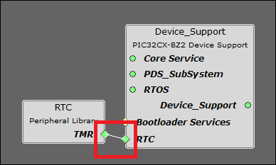
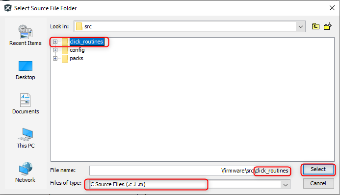
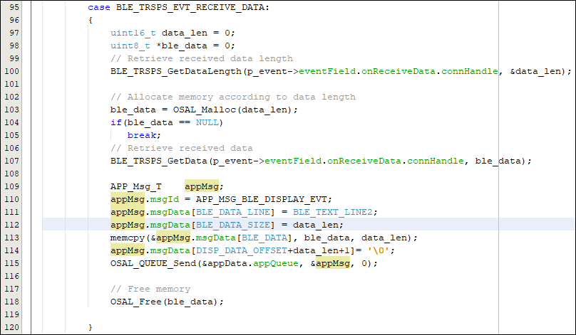
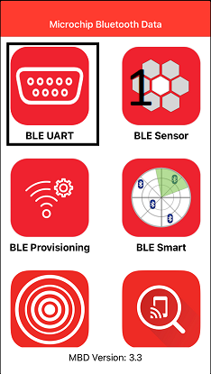
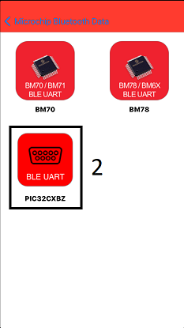

# WBZ45x BLE UART WITH E-PAPER DISPLAY


> "IOT Made Easy!" 

Devices: **| PIC32CXBZ2 | WBZ45x |**<br>
Features: **| BLE | E-PAPER |**


## ⚠ Disclaimer

<p><span style="color:red"><b>
THE SOFTWARE ARE PROVIDED "AS IS" AND GIVE A PATH FOR SELF-SUPPORT AND SELF-MAINTENANCE. This repository contains example code intended to help accelerate client product development. </br>

For additional Microchip repos, see: <a href="https://github.com/Microchip-MPLAB-Harmony" target="_blank">https://github.com/Microchip-MPLAB-Harmony</a>

Checkout the <a href="https://microchipsupport.force.com/s/" target="_blank">Technical support portal</a> to access our knowledge base, community forums or submit support ticket requests.
</span></p></b>

## Contents

1. [Introduction](#step1)
1. [Bill of materials](#step2)
1. [Hardware Setup](#step3)
1. [Software Setup](#step4)
1. [Harmony MCC Configuration](#step5)
1. [Board Programming](#step6)
1. [Run the demo](#step7)

## 1. Introduction<a name="step1">

This application demonstrates the use of an E-Paper Bundle 2 Display interfaced with WBZ451 Curiosity Board using Serial Pheripheral Interface (SPI) protocol. WBZ451 Curiosity board receives data from Microchip Bluetooth Data [(MBD)](https://play.google.com/store/apps/details?id=com.microchip.bluetooth.data&hl=en_IN&gl=US) application through Bluetooth Low Energy (BLE) using [TRANSPARENT BLE UART](https://github.com/Microchip-MPLAB-Harmony/wireless_apps_pic32cxbz2_wbz45/tree/master/apps/ble/building_blocks/peripheral/profiles_services/peripheral_trp_uart) and sends the received data to E-PAPER Display.


The E-Paper 2.13" display is based on Active Matrix Electrophoretic Display (AMEPD) technology and has an integrated pixel driver, which uses the SPI interface to communicate with the host MCU. 

## 2. Bill of materials<a name="step2">

| TOOLS | QUANTITY |
| :- | :- |
| [PIC32CX-BZ2 and WBZ451 Curiosity Development Board](https://www.microchip.com/en-us/development-tool/EV96B94A) | 1 |
| [E-Paper Bundle 2](https://www.mikroe.com/e-paper-bundle-2) | 1 |

## 3. Hardware Setup<a name="step3">

- Connect the E-Paper Bundle 2 with the WBZ451 CURIOSITY BOARD using the below table.


|     WBZ451    |E-PAPER | Description |     WBZ451    |E-PAPER | Description |
| :- | :- | :- | :- |:- | :- |
|     AN        |    15(BSY) |    BUSY   |    PWM        |    16(D/C)|     Data/Command   |
|     RST       |    2(RST) |    RESET    |    INT        |    NC     |     NC      |
|     CS        |    3(CS)  | CHIP SELECT |    RX         |    NC     |     NC      |
|     SCK       |    4(SCK) |    SPI CLOCK   |    TX         |    NC     |     NC      |
|     MISO      |    NC     |    NC     |    SCL        |    NC     |     NC      |
|     MOSI      |    6(MOSI)|    SERIAL DATA INPUT     |    SDA        |    NC     |     NC      |
|     3.3V      |    7(3.3V)|    POWER SUPPLY      |    5V         |    NC     |     NC      |
|     GND       |    8 (GND)|    GROUND      |    GND        |    9 (GND)|     GROUND    |

| Note: PIN 15 (BSY) of E-PAPER should be connected with AN of WBZ451 !! |
| --- |

 

## 4. Software Setup<a name="step4">

- [MPLAB X IDE ](https://www.microchip.com/en-us/tools-resources/develop/mplab-x-ide#tabs)

    - Version: 6.00
	- XC32 Compiler v4.10
	- MPLAB® Code Configurator v5.1.17
	- PIC32CX-BZ_DFP v1.0.107
	- MCC Harmony
	  - csp version: v3.13.1
	  - core version: v3.11.1
	  - CMSIS-FreeRTOS: v10.4.6
	  - wireless_pic32cxbz_wbz: v1.0.0
	  - wireless_ble: v1.0.0	  
	  - dev_packs: v3.13.1
	  - wolfssl version: v4.7.0
	  - crypto version: v3.7.6
	    

- [Microchip Bluetooth Data (MBD) iOS/Android app](https://play.google.com/store/apps/details?id=com.microchip.bluetooth.data&hl=en_IN&gl=US)

- [MPLAB X IPE v6.00](https://microchipdeveloper.com/ipe:installation)

## 5. Harmony MCC Configuration<a name="step5">

### Getting started with E-PAPER DISPLAY with WBZ451 CURIOSITY BOARD.

| Tip | New users of MPLAB Code Configurator are recommended to go through the [overview](https://onlinedocs.microchip.com/pr/GUID-1F7007B8-9A46-4D03-AEED-650357BA760D-en-US-6/index.html?GUID-AFAB9227-B10C-4FAE-9785-98474664B50A) |
| :- | :- |

**Step 1** - Connect the WBZ451 CURIOSITY BOARD to the device/system using a micro-USB cable.

**Step 2** - The project graph of the E-PAPER application is shown below.


**Step 3** - In MCC harmony project graph, Add the SERCOM1 component under Libraries->Harmony->Peripherals->SERCOM->SERCOM1. select SERCOM1 and add "SPI" satisfiers by right click on the "⬦" near SPI to add the SPI component which will prompt an Auto-activation for "core"&"FreeRTOS" component, give yes to add the component and configure SERCOM1 and SPI as shown below.


**Step 4** - In MCC harmony project graph, Add the BLE Stack from device resources under Libraries->Harmony->wireless->drivers->BLE and will prompt an Auto-activation for "Device_Support","PDS_SubSystem","NVM","Cryptographic","wolfcrypt Library" component, give yes to add the component and give yes to Auto-connect.

- In Device_Support add satisfiers by right click on the "⬦" in Device_Support->RTC to add the RTC component.




- Configure the BLE Stack as Shown below.

 


**Step 5** - In MCC harmony project graph, select wolfCrypt Library and configure as mentioned below.


**Step 6** - In MCC harmony project graph, Add Transparent profile from device resources under Libraries->Harmony->wireless->drivers->BLE->Profiles and configure as shown below.


- To add satisfiers as shown below right click on the "⬦" in Transparent profile->Transparent Services and add the satisfier "Transparent Services" to add the component as shown below.


**Step 7** - In MCC harmony project graph, Add CONSOLE from Device Resources under Libraries->Harmony->System Services to add the "CONSOLE" component as shown below.


- To add satisfiers as shown above right click on the "⬦" in CONSOLE->UART and add the satisfier "SERCOM0" to add the component. Then select the SERCOM0 to configure as shown below.


**Step 8** - In MCC harmony project graph, select system and configure as mentioned below.


**Step 9** - In MCC harmony project graph, select Core and verify the mentioned below.


**Step 10** - In MCC harmony project graph, select FreeRTOS and configure as mentioned below.


**Step 11** - In project graph, go to Plugins->Pin configurations->Pin settings and set the pin configuration as shown below.

- Use these PIN Names while configuring.

```
CLICK_EINK_BUNDLE_CS
CLICK_EINK_BUNDLE_DC
CLICK_EINK_BUNDLE_RST
CLICK_EINK_BUNDLE_BSY
```


**Step 12** - [Generate](https://onlinedocs.microchip.com/pr/GUID-A5330D3A-9F51-4A26-B71D-8503A493DF9C-en-US-1/index.html?GUID-9C28F407-4879-4174-9963-2CF34161398E) the code.

**Step 13** - From the unzipped folder copy the folder click_routines(which contains the eink_bundle.h, eink_bundle_font.h, eink_bundle_image.h, eink_bundle.c,  eink_bundle_font.c, eink_bundle_image.c) to the folder firmware/src under your MPLAB Harmony v3 application project and add the Header (eink_bundle.h, eink_bundle_font.h, eink_bundle_image.h) and Source file (eink_bundle.c, eink_bundle_font.c, eink_bundle_image.c).

- In the project explorer, Right click on folder Header Files and add a sub folder click_routines by selecting “Add Existing Items from Folders…”


- Click on “Add Folder…” button.


- Select the “click_routines” folder and select “Files of Types” as Header Files.


- Click on “Add” button to add the selected folder.


- The eink bundle header files gets added to your project.


- In the project explorer, Right click on folder Source Files and add a sub folder click_routines by selecting “Add Existing Items from Folders…”.


- Click on “Add Folder…” button


- Select the “click_routines” folder and select “Files of Types” as Source Files.



- Click on “Add” button to add the selected folder


- The eink bundle source files gets added to your project.


- The click_routines folder contain an C source file eink_bundle.c. You could use eink_bundle.c as a reference to add E-Paper display functionality to your application.

**Step 14** - Change the following Code as givien below.

- In your MPLAB Harmony v3 based application go to "firmware\src\app_user_edits.c", make sure the below code line is commented.

```
//#error User action required - manually edit files as described here.
```

- In your MPLAB Harmony v3 based application go to "firmware\src\config\default\peripheral\sercom\spi_master\plib_sercom1_spi_master.c" and do the following changes.
  
  - At Line 177 include the following code to setup the clock frequency.  
  
	```
	if (setup->clockFrequency == 0)
		{
			baudValue = SERCOM1_SPIM_BAUD_VALUE;
		}
		else
		{
			baudValue = (spiSourceClock/(2U*(setup->clockFrequency))) - 1U;
		}
	```		


- In your MPLAB Harmony v3 based application go to "firmware\src\app.h" and do the following changes.

	- Copy & Paste the Code in [app.h](https://github.com/MicrochipTech/PIC32CXBZ2_WBZ45x_BLE_UART_E_PAPER_Display/blob/main/WBZ451_E_PAPER_BLE_UART/firmware/src/app.h)

- In your MPLAB Harmony v3 based application go to "firmware\src\app.c" and do the following changes.

	- Copy & Paste the Code in [app.c](https://github.com/MicrochipTech/PIC32CXBZ2_WBZ45x_BLE_UART_E_PAPER_Display/blob/main/WBZ451_E_PAPER_BLE_UART/firmware/src/app.c)

- In your MPLAB Harmony v3 based application go to "firmware\src\app_ble\app_ble_handler.c" and do the following changes.
	
	- Include the following code in Header.
	
		```
		#include "system/console/sys_console.h"
		#include "peripheral/sercom/usart/plib_sercom0_usart.h"
		#include "click_routines/eink_bundle/eink_bundle.h"
		#include "app.h"	
		
		extern uint16_t conn_hdl;
			
		```
	
	
	
	- Under the Switch Case "BLE_GAP_EVT_CONNECTED" add the following code.
	
		```
		APP_Msg_T    appMsg;
		appMsg.msgId = APP_MSG_BLE_DISPLAY_EVT;
		appMsg.msgData[BLE_DATA_LINE] = BLE_TEXT_LINE1;
		appMsg.msgData[BLE_DATA_SIZE] = BLE_TEXT_STATUS_SIZE;
		memcpy(&appMsg.msgData[BLE_DATA], " CONNECTED  ", BLE_TEXT_STATUS_SIZE);            
		appMsg.msgData[DISP_DATA_OFFSET+BLE_TEXT_STATUS_SIZE+1]= '\0';
		SERCOM0_USART_Write((uint8_t *)"Connected\r\n",11);
		conn_hdl = p_event->eventField.evtConnect.connHandle;
		OSAL_QUEUE_Send(&appData.appQueue, &appMsg, 0);

		```
	
	

	- Under the Switch Case "BLE_GAP_EVT_DISCONNECTED" add the following code.
	
		```
		APP_Msg_T    appMsg;
		appMsg.msgId = APP_MSG_BLE_DISPLAY_EVT;
		appMsg.msgData[BLE_DATA_LINE] = BLE_TEXT_LINE1;
		appMsg.msgData[BLE_DATA_SIZE] = BLE_TEXT_STATUS_SIZE;
		memcpy(&appMsg.msgData[BLE_DATA], "DISCONNECTED", BLE_TEXT_STATUS_SIZE);             
		appMsg.msgData[DISP_DATA_OFFSET+BLE_TEXT_STATUS_SIZE+1]= '\0';
		SERCOM0_USART_Write((uint8_t *)"Disconnected\r\n",14);
		conn_hdl = 0xFFFF;
		BLE_GAP_SetAdvEnable(0x01, 0);
		OSAL_QUEUE_Send(&appData.appQueue, &appMsg, 0);

		```
	
	

	
- In your MPLAB Harmony v3 based application go to "firmware\src\app_ble\app_trsps_handler.c" and do the following changes.

	- Include the following code in Header.
	
		```
		#includ#include "osal/osal_freertos_extend.h"
		#include "definitions.h"
		#include "click_routines/eink_bundle/eink_bundle.h"	 
		```
	
	
	
	- Under the Switch Case "BLE_TRSPS_EVT_RECEIVE_DATA" add the following code.
	
		```
		uint16_t data_len = 0;
		uint8_t *ble_data = 0;
		// Retrieve received data length
		BLE_TRSPS_GetDataLength(p_event->eventField.onReceiveData.connHandle, &data_len);

		// Allocate memory according to data length
		ble_data = OSAL_Malloc(data_len);
		if(ble_data == NULL)
		   break;            
		// Retrieve received data
		BLE_TRSPS_GetData(p_event->eventField.onReceiveData.connHandle, ble_data);

		APP_Msg_T    appMsg;
		appMsg.msgId = APP_MSG_BLE_DISPLAY_EVT;
		appMsg.msgData[BLE_DATA_LINE] = BLE_TEXT_LINE2;
		appMsg.msgData[BLE_DATA_SIZE] = data_len;
		memcpy(&appMsg.msgData[BLE_DATA], ble_data, data_len);
		appMsg.msgData[DISP_DATA_OFFSET+data_len+1]= '\0';
		OSAL_QUEUE_Send(&appData.appQueue, &appMsg, 0);

		// Free memory	
		OSAL_Free(ble_data);

		```
	
	

	
- In your MPLAB Harmony v3 based application go to "firmware\src\app_ble\app_ble.c" and do the following changes.

	- Under the "APP_BleConfigBasic()" add the following code.
	
		```
		BLE_GAP_Addr_T devAddr;
		devAddr.addrType = BLE_GAP_ADDR_TYPE_PUBLIC;
		devAddr.addr[5] = 0xD1;
		devAddr.addr[4] = 0xD2;
		devAddr.addr[3] = 0xD3;
		devAddr.addr[2] = 0xD4;
		devAddr.addr[1] = 0xD5;
		devAddr.addr[0] = 0xD6;

		```
	
	
	
	
**Step 15** - Clean and build the project. To run the project, select "Make and program device" button.

**Step 16** - To the test the application in MBD app follow the steps provided below and the link for the [TRANSPARENT BLE UART](https://github.com/Microchip-MPLAB-Harmony/wireless_apps_pic32cxbz2_wbz45/tree/master/apps/ble/building_blocks/peripheral/profiles_services/peripheral_trp_uart).

     

| Note: For Android App Select BM70 instead of PIC32CXBZ in the step 2 as mentioned above !! |
| --- |

## 6. Board Programming<a name="step6">

## Programming hex file:

### Program the precompiled hex file using MPLAB X IPE

- The Precompiled hex file is given in the hex folder.
Follow the steps provided in the link to [program the precompiled hex file](https://microchipdeveloper.com/ipe:programming-device) using MPLABX IPE to program the pre-compiled hex image. 


### Build and program the application using MPLAB X IDE

The application folder can be found by navigating to the following path: 

- "WBZ451_E_PAPER_BLE_UART\firmware\WBZ451_E_PAPER_BLE_UART.X"

Follow the steps provided in the link to [Build and program the application](https://github.com/Microchip-MPLAB-Harmony/wireless_apps_pic32cxbz2_wbz45/tree/master/apps/ble/advanced_applications/ble_sensor#build-and-program-the-application-guid-3d55fb8a-5995-439d-bcd6-deae7e8e78ad-section).

## 7. Run the demo<a name="step7">

- After programming the board, the expected application behavior is shown in the below [video](https://github.com/MicrochipTech/PIC32CXBZ2_WBZ45x_BLE_UART_E_PAPER_Display/blob/main/docs/Working_Demo.gif).


